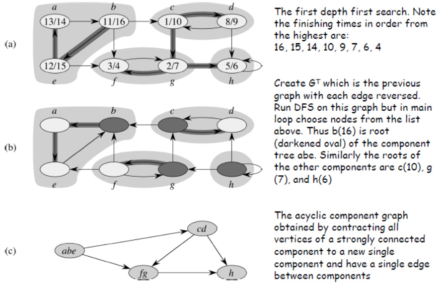

Digraph: Finding Strongly Connected Components (SCC)
====================================================

## Strongly Connected Component (Definition)
* A directed graph is *strongly connected* if every two
vertices are reachable from each other

## STRONGLY-CONNECTED-COMPONENTS(G)
1. Call DFS(G) to compute finishing times u.f for each vertex u
2. Computer G^T
    * Same nodes as G with all edges reversed
3. Call DFS(G^T) but in main loop DFS, consider the vertices in order of decreasing u.f for the finishing times in (1).
4. Output the vertices of each tree in the depth-first forest formed in (3) as a separate strongly connected component

=> The order of the first one makes the DFS of the second break up into components each time a root is returned to. Those traversed during each root search make up a single component

## Time Complexity
Linear, `θ(V + E)

## Example

