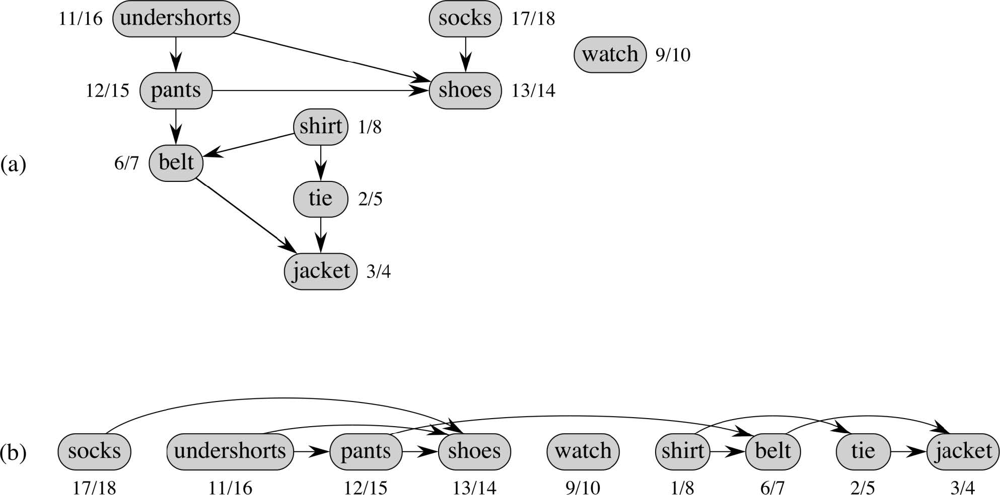

Digraph: Topological Sort
=========================
* Sorts a graph into a linear ordering of vertices such that for any edge (v, w) in E, v precedes w in the topological ordering
* Time Complexity θ(V + E)
* Cannot have a cycle

## Modified DFS Algorithm
1. Call DFS(G) to compute finishing times v.f for each vertex v (start = edge with no incoming)
2. As each vertex is finished, insiert it onto the front of a linked list
3. Return the linked list of vertices

### Example
"Getting dressed in the morning"

## Conceptual Algorithm
1. Identify vertices that have no incoming edges (none => there is a cycle and no sort possible)
2. Select one such vertex as the start
3. Delete this vertex and place in output
4. Repeat 1-3 until graph is empty.
