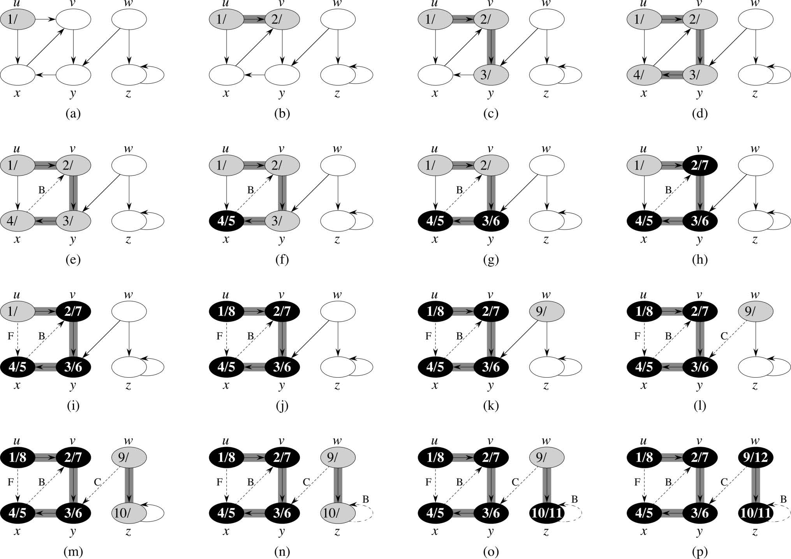

Depth-First Search (DFS)
==========================
* A way to visit vertices and edges of a graph, searching deeper into the graph instead of visiting the current node whenever possible
* Explores the edges out of the most recently discovered vertex first
* Traverses a connected component of a graph, and in doing so defines a tree
* Creates a forest of trees that are reachable from the tree roots
* Great visualization [here](https://www.cs.usfca.edu/~galles/visualization/DFS.html)
* Time Complexity = θ(V + E)


## Example DFS Algorithm
* Input: G = (V, E)
    * directed or undirected.
    * No source vertex is assigned
* Output: 2 timestamps for each vertex
    * v.discovery = discovery time
    * v.finish = finishing time
* Explore every edge
    * start from different vertices as needed
    * as soon as a vertex is discovered, explore from it
    * keep track of a predecessor tree by keeping track of a predecessor function v.parent for each node
* As algorithm progresses vertex colors represent
    * white: undiscovered node
    * gray: discovered node but not finished exploring
    * black: finished exploring from this node
* You can simply keep a visited array mirroring vector positions instead of the colors in a real example, as in the visualization

```
DFS(G):
    for each vertex u in G.V:
        u.color = white
        u.parent = null
    time = 0
    for each vertex u in G.V:
        if u.color == white:
            DFS-VISIT(G, u, time)

DFS-VISIT(G, u):
    time += 1
    u.discovery = time
    u.color = gray
    for each v in G.Adj[u]:
        if v.color == white:
            v.parent = u
            DFS-VISIT(G, v, time)
    u.color = black;
    time += 1
    u.finish = time

```

### Example

