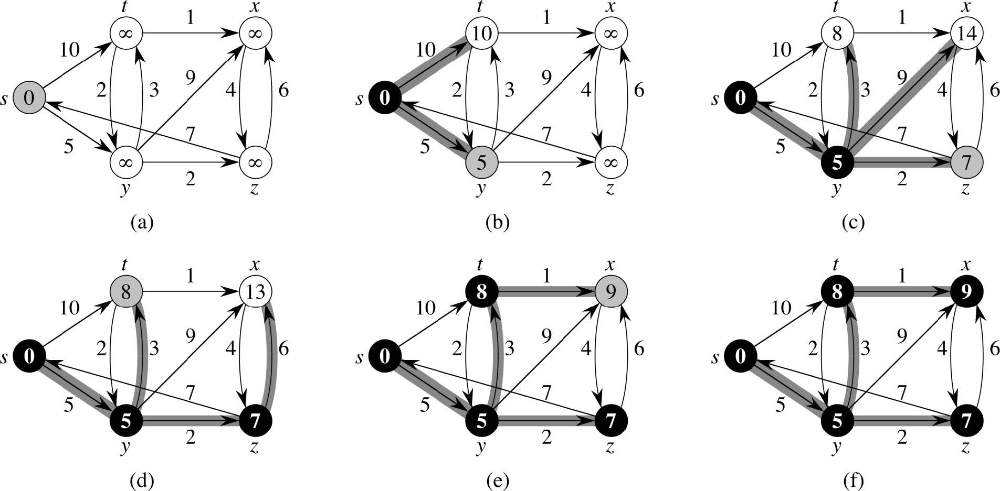

Dijkstra's Algorithm for Shortest Path
======================================
* No negative-weight edges
* Essentially a weighted version of breadth-first search.
    * Instead of a FIFO queue, uses a priority queue.
    * Keys are shortest-path weights ( v.d).
* Have two sets of vertices:
    * S = vertices whose final shortest-path weights are determined,
    * Q = priority queue = V - S.
* Solves the shortest path for ALL vertices from a the source *s*
    * Solution may be used to find the shortest path between *s* and any vertex *v* by tracing back v.π until the reverse-path reaches *s*.
* Looks a lot like Prim’s algorithm, but computing v.d and using shortest-path weights as keys.
* Dijkstra’s algorithm can be viewed as greedy, since it always chooses the “lightest” or “closest” vertex in V -S to add to S.

```
DIJKSTRA(G, w, s):
    INIT-SINGLE-SOURCE(G, s)

    // Shortest path not determined yet for any vertex.
    // This will be an array of vertecies with v.d as the final shortest distance estimate
    // This output may be used with v.π to determine actual paths
    S = {}

    // Insert all vertices into priority queue, asc. v.d
    Q = G.V

    while Q is not empty:
        // Get the next in the queue and add it to shortest, first is s
        u = EXTRACT-MIN(Q)
        S = S ⋃ {u}

        // update each neighbor of u
        for each vertex v ∈ G.Adj[u]
            RELAX(u, v, w)
            // Decrease-key v.d in priority queue so that it gets moved to the
            // correct position since its key has changed

    return S
```

## Example



## Analysis
* Like Prim’s algorithm, depends on implementation of priority queue.
    * If binary heap, each operation takes O(lg V) time
        * complexity is O(E lg V).
    * If a Fibonacci heap, each EXTRACT-MIN takes O(1) amortized time and there are O(V) other operations taking O(lg V) amortized time each
        * complexity is O(V lg V + E).
