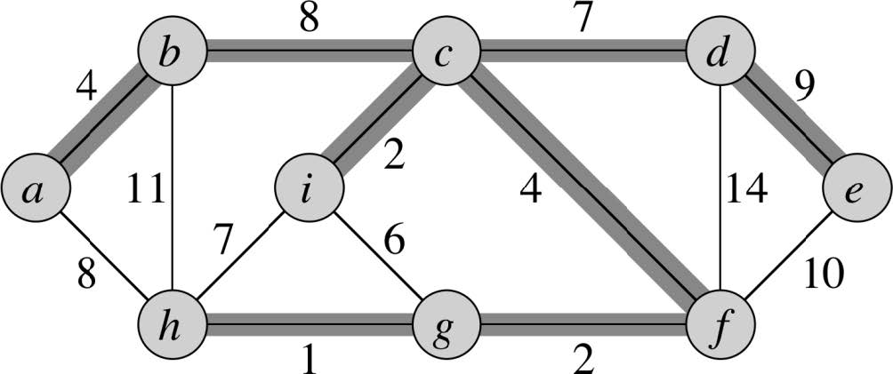

Minimum Spanning Tree (MST)
=====================
* Undirected graph G = (V, E)
    * Weight (or cost) w(u, v) on each edge (u, v) ∈ E
* Minimum spanning tree: a tree T ⊆ E that **connects all vertices** and has **minimum weight**.
    * T is called a spanning tree if it connects all vertices
    * minimize w(T) = Σ_{(u, v) ∈ T}(w(u, v)), over all spanning trees


## Properties
* |E| = |V| - 1
* No cycles
* Might not be unique (can have multiple MST solutions)

## Example

Total Cost = 37

## Generic Algorithm (Greedy)
```
GENERIC-MST(G, w):
    A = {}      // A is a set of edges building up to an MST
    while A is not a spanning tree:
        find an edge (u, v) that is safe for A
        A = A ⋃ {(u,v)}
    return A
```

In this generic algorithm we build a solution by:
* Building a set A of edges starting from the empty set
* As we add an edge, we want to maintain the loop invariant:
    * A is a subset of some MST
* Add only edges that maintain this invariant. An edge is safe for A if when added to A the loop invariant is maintained. Such an edge is call a **safe** edge

### Finding a safe edge
Let A be a subset of some MST, (S, V – S) be a cut that respects A and (u, v) be a light edge that crosses (S, V – S). Then (u, v) is safe for A.
