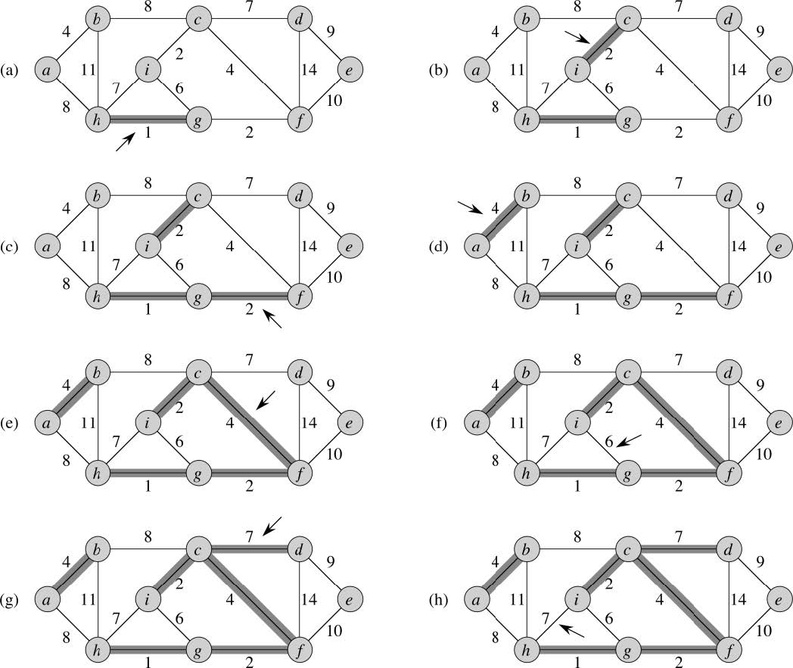
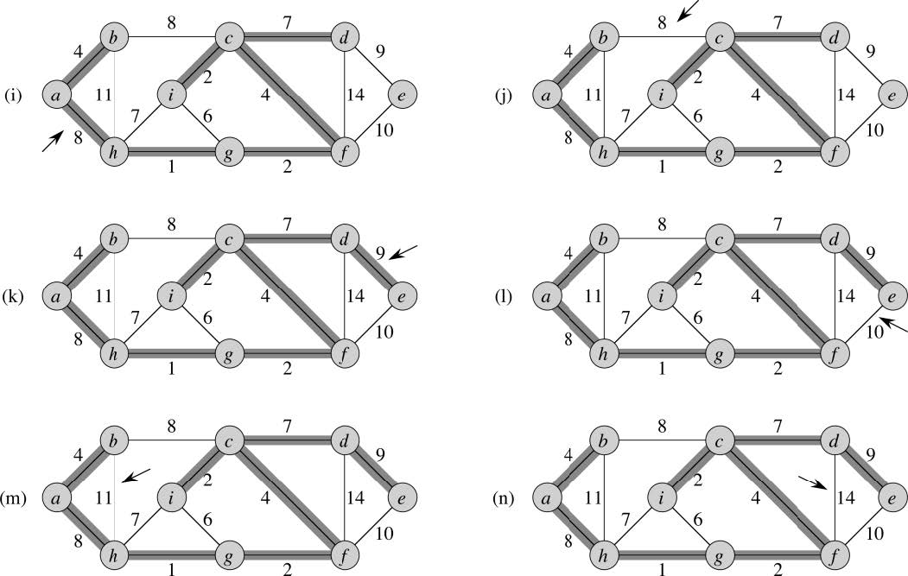

Kruskal's Algorithm for MST
===========================
* Kruskal’s adds edges starting with a forest of trees.
* It sorts the edges by cost and tries to add edges in order of ascending (nondecreasing) order of cost
* An edge can be added if it connects two different trees (sets) in the forest. An edge cannot be added if it is added to the same set or same tree. In this case a cycle would be formed. Only safe edges are added.
* The edge that is added is a light edge from one tree (C1 component) to another tree (C2 component) that is in the forest G_A.

## Algorithm
```
MST-KRUSKAL(G, w)
    A = {}
    for each vertex v in G.V:
        Make-Set(v)
    Sort the edges of G.E into ascending order by cost
    for each edge (u, v) in G.E, considered in ascending order:
        if Find-Set(u) != Find-Set(v):
            // Vertices not in the same set, it is okay to add the edge
            A = A ⋃ {(u, v)}
            // Combine the two sets/trees
            Union(u, v)
    return A
```

## Example 1




## Complexity
* Initial A: O(1)
* First for loop: |V| Make-Set operations. Each node is a separate tree in the forest. No edges added to A yet.
* Sort E: O(E lg E) to sort the edges.
* Second for loop: O(E) Find-Sets and Unions
    * Assume the implementation of disjoint-set Union Find with path compression and union by rank
    * Then we have, for this loop: O((V + E) α(V))
* Total time is O((V + E) α(V)) + O(E lg E)
    * since G is connected, |E| ≥ |V| - 1
    * α(V) = O(lg V) = O(lg E)
* Total time is O(E lg E)
    * Can also be stated as O(E lg V) since for graphs O(lg E) = O(lg V)
