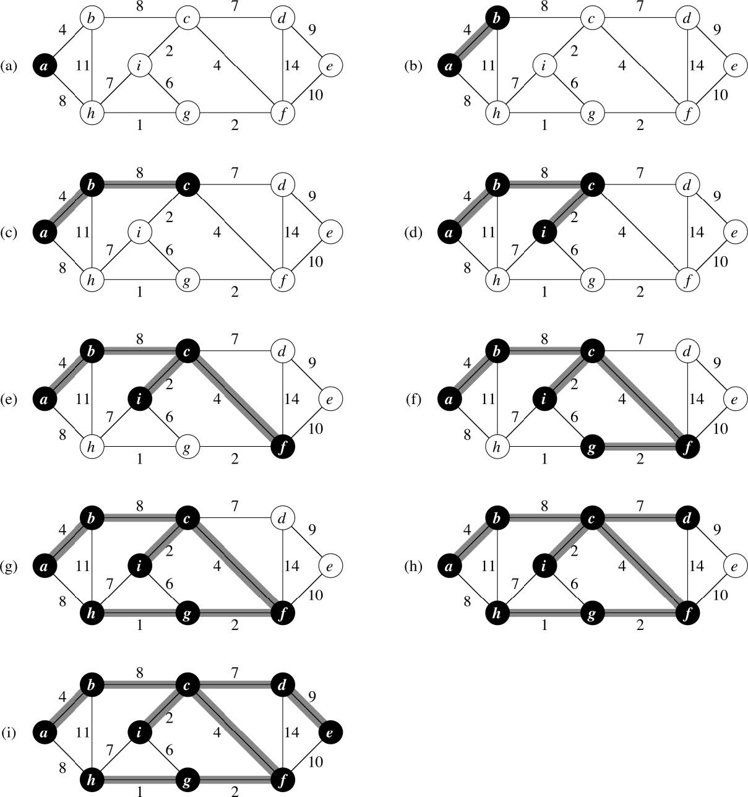

Prim's Alrgorithm (MST)
=======================
* Prim’s starts with an arbitrary node that is the “growing tree” and there is always one tree that is extended.
* A node is added that is the least cost node that connects to the current tree. Connecting to a tree means to connect to some node in the tree.
* This results in an extended tree by adding the corresponding edge. Again, the next least cost node (and edge) is added to the extended tree, etc.
* Note that the growing tree is always the set of edges A. Each step adds a light edge to an isolated vertex in the set V – A.

## Algorithm
```
MST-PRIMM(G, w, r):
    // Create a set of edges for the final tree
    A = {}

    for each u in G.V:
        // Initialize each key (distance) and parent to invalids
        u.key = ∞
        u.parent = null

    // Root of the tree has distance 0
    r.key = 0

    // Put all vertices into a priority queue (using the .key)
    Q = G.V
    while Q is not empty:
        // Get minimum element, initially r
        u = Extract-Min(Q)

        // Check each neighbor of u
        for each v in G.Adj[u]:
            if v in Q and w(u, v) < v.key:
                // Is still pending and the path from r -~- u -> v is less than any already known path r -~-> v

                // Extend the tree to include v
                v.parent = u
                v.key = w(u, v)
                A = A ⋃ {(u, v)}

                // NOTE: Decreasing the key involves a O(log(V)) operation in the min-heap, since v must now be reordered
    return A
```

## Example



## Complexity
* Build Min-heap O(V)
* While loop executes |V| times
    * each Extract-Min operation is lg V; total time is V lg V
    * all the for loop calls together in the while loop are 2|E|
* within for loop besides constant time the only time cost is the Decrease-Key cost (v.key = w(u,v)) which is lg V
* total time for this part is thus E lg V
* Total time is thus O(V lg V + E lg V) which is thus O(E lg V) since for a connected graph |E| ≥ |V| - 1
* This is asymptotically the same as Kruskal’s algorithm
