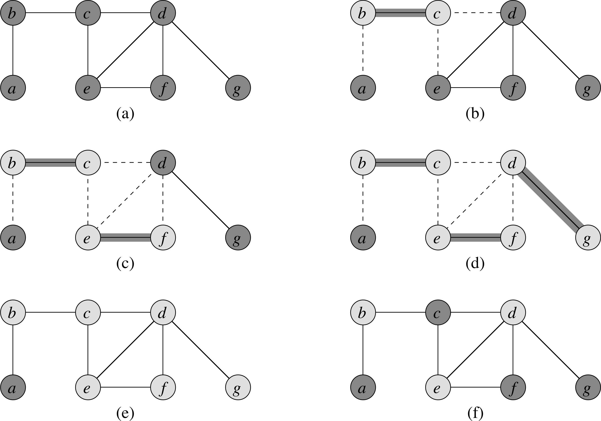

Approximation: Vertex Cover
===========================

## Problem
* Given a graph G = (V, E), a vertex cover is a subset V’ ⊆ V such that if (u, v) is an edge of G, then either u ∈ V’ or v ∈ V’
* Find a vertex cover of smallest cardinality


## Approximation Algorithm for Vertex Cover
1. Choose a maximal matching
    * A matching is a set of edges such that no two edges share a vertex in common
2. Output all vertices that are end point of all edges in the matching
3. The set of vertices is a vertex cover
4. APPROX = 2 x size of a maximal matching
    * Since size of matching ≤ OPT, APPROX ≤ 2 OPT

* Note: the algorithm in the text finds a maximal matching
    * It turns out that using a maximum matching will not improve the bound


```
APPROX-VERTEX-COVER(G):
    C = {}
    E' = G.E
    while E' is not empty
        let (u, v) be an arbitrary edge of E'
        C = C ⋃ {u,v}
        remove from E' every edge incident on either u or v
    return C
```

=> **Choose vertices of a selection of edges who do not touch**

## Example


* Fig (a) - (e) depicts process, resulting in a cardinality of 6 as a maximal matching, containing b, c, d, e, f, and g.
    * Using approximation, we can say for sure that our `APPROX <= 2*OPT`
* Fig (f) is the optimal cover  with a cardinality of 3
* In this case, the APPROXimation is 6 and the OPTimal solution is 3, which satisfies the equation `(6) <= 2*3`
