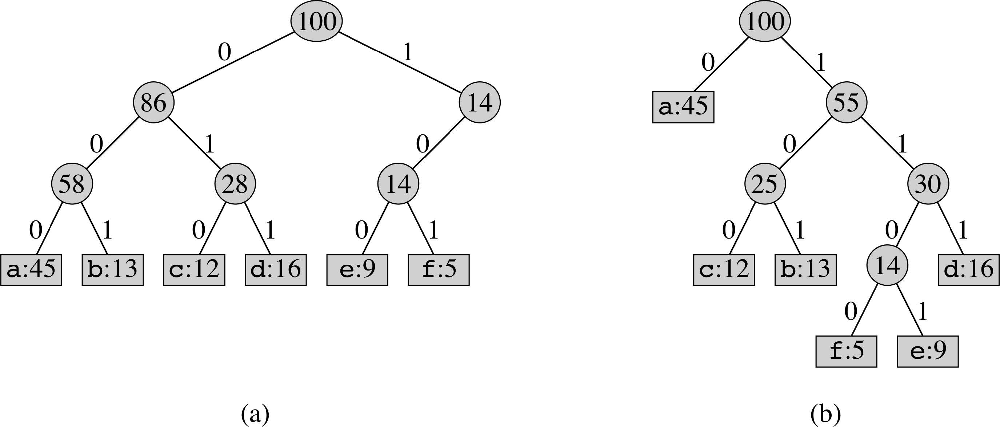
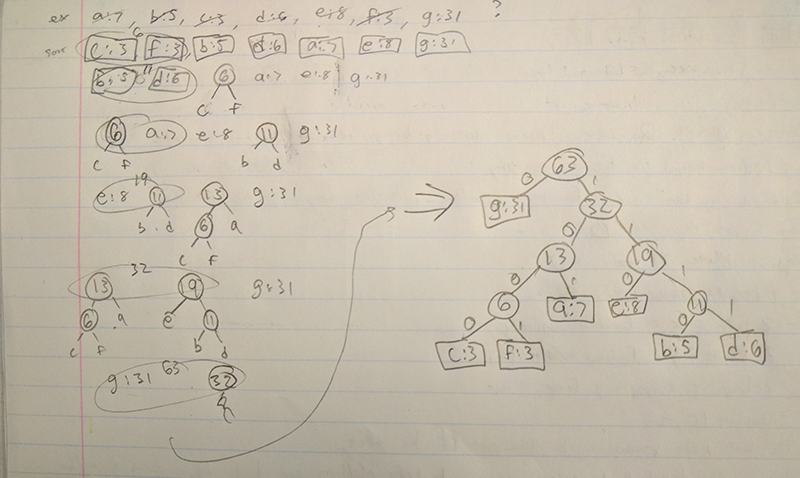

Huffman Codes
=============
* Variable number of bits for characters to preserve space
* Fewer bits for more frequent characters
* No code should prefix another code

## Example
|     | a   | b   | c   | d   | e   | f   |
| --- | --- | --- | --- | --- | --- | --- |
| Frequency (in thousands) | 45 | 13 | 12 | 16 | 9 | 5 |
| Fixed-length codeword | 000 | 001 | 010 | 011 | 100 | 101 |
| Variable-length codeword | 0 | 101 | 100 | 111 | 1101 | 1100 |

String `aabaaf`
* Fixed Length = `000000000001000000101` (18 bits)
* Variable Length = `00101001100` (11 bits)

### Codes as Binary Trees

* (a) Fixed Length: Balanced Tree
* (b) Variable Length: Full Binary Tree

## Construction Algorithm
* A priority queue Q contains nodes currently being considered
    * Priority queue (min-heap) is initially empty
* Create a leaf node for each symbol with its frequency as the key and insert into the priority queue
* Repeat while there is more than one node in the priority queue
    * Allocate a new node z
    * z.left-child = x = Extract-Min(Q)
    * z.right-child = y = Extract-Min(Q)
    * z.frequency = x.frequency + y.frequency
    * Insert(Q, z)
* The last node remaining in Q is the root of the tree
* Assign the label 0 to edges going to left children and 1 to edges
going to right children

### In simple terms
* Priority queue by ascending frequency
* Insert all symbol:freq into queue (will be a list sorted by freq)
* First two become left/right child of new node which will the sum of their freq. and is then inserted
* Repeat until 1 node => root
* Left edge = 0, right edge = 1
* Navigate down tree to each symbol to get final code

*Tip: When creating the tree only list the frequency numbers of the leaves in the queue at each step, making the writing faster. Be sure to add them back at the end in the final tree.*

### Example
#### Question
What is the optimal Huffman code for the following set of frequencies: a:7, b:5, c:3, d:6, e:8, f:3, g:31?
#### Solution
* Sort the frequencies to get the following order: c:3, f:3, b:5, d:6, a:7, e:8, g:31
* We then construct the tree.

* Then we use the tree to get the codes (DO NOT FORGET!)

| Symbol | Bit Code |
| --- | --- |
| a | 101 |
| b | 1110 |
| c | 1000 |
| d | 1111 |
| e | 110 |
| f | 1001 |
| g | 0 |
