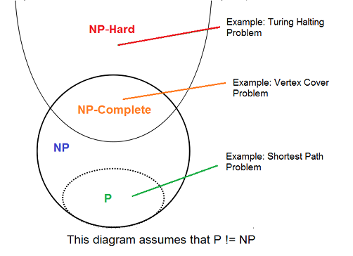

NP-Completeness
===============

A problem is NP-complete if:
* It is in NP
* Every NP problem is reduced to it (in polynomial time)
* That is, it is the most difficult problem in NP

Can we solve?
* If we **can** solve any NP-complete problem in Deterministic Polynomial Time (P time) then we know: `P = NP`
* If we prove that we **cannot** solve an NP-complete problem in Deterministic Polynomial Time (P time) then we know: `P != NP` (largely believed to be the case)

## Decision Problems
* A decision problem involves YES/NO answers
* Input with answer YES can be considered to be in the corresponding language
* We often have to solve optimization problems
    * These problems usually are self-reducible, in the sense that if the value of the solution is known, then the actual solution can also be obtained in polynomial time
    * To create a decision problem from an optimization problem, we will give the same input and a number k, and ask whether a solution of value at most (or at least) k exists

## Complexity Classes

### P
`P` is a complexity class that represents the set of all decision problems that can be solved in polynomial time. That is, given an instance of the problem, the answer yes or no can be decided in polynomial time.

=> All tractable problems

#### Example
Given a graph connected G, can its vertices be colored using two colors so that no edge is monochromatic?

**Algorithm:** Start with an arbitrary vertex, color it red and all of its neighbours blue and continue. Stop when you run out of vertices or you are forced to make an edge have both of its endpoints be the same color.

### NP
`NP` is a complexity class that represents the set of all decision problems for which the instances where the answer is "yes" have proofs that can be verified in polynomial time.

This means that if someone gives us an instance of the problem and a certificate (sometimes called a witness) to the answer being yes, we can check that it is correct in polynomial time.

=> Problems whose solution can be **verified in polynomial time**

#### Example
Integer factorization is in NP. This is the problem that given integers `n` and `m`, is there an integer `f` with `1 < f < m`, such that `f` divides `n` (`f` is a small factor of `n`)?

This is a decision problem because the answers are yes or no. If someone hands us an instance of the problem (so they hand us integers n and m) and an integer `f` with `1 < f < m`, and claim that `f` is a factor of `n` (the certificate), we can check the answer in polynomial time by performing the division `n / f`.

### NP-Complete
NP-Complete is a complexity class which represents the set of all problems `X` in NP for which it is possible to reduce any other NP problem `Y` to `X` in polynomial time.

Intuitively this means that we can solve `Y` quickly if we know how to solve `X` quickly. Precisely, `Y` is reducible to `X`, if there is a polynomial time algorithm `f` to transform instances `y` of `Y` to instances `x = f(y)` of `X` in polynomial time, with the property that the answer to `y` is yes, if and only if the answer to `f(y)` is yes.

What makes NP-complete problems important is that if a deterministic polynomial time algorithm can be found to solve one of them, every NP problem is solvable in polynomial time (one problem to rule them all).

## NP-Complete Problem Examples
* The Traveling Salesperson Problem
* Vertex cover
* Hamiltonian Path

### NP-Hard
Intuitively, these are the problems that are at least as hard as the NP-complete problems. Note that NP-hard problems do not have to be in NP, and they do not have to be decision problems.

The precise definition here is that a problem `X` is NP-hard, if there is an NP-complete problem `Y`, such that `Y` is reducible to `X` in polynomial time.

But since any NP-complete problem can be reduced to any other NP-complete problem in polynomial time, all NP-complete problems can be reduced to any NP-hard problem in polynomial time. Then, if there is a solution to one NP-hard problem in polynomial time, there is a solution to all NP problems in polynomial time.
