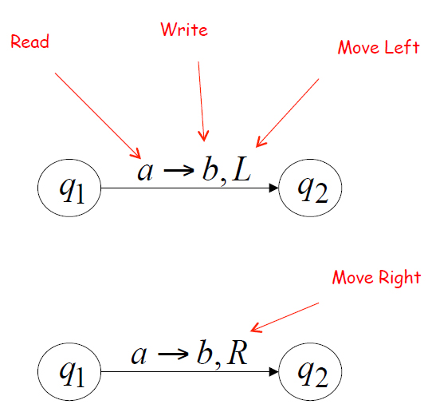
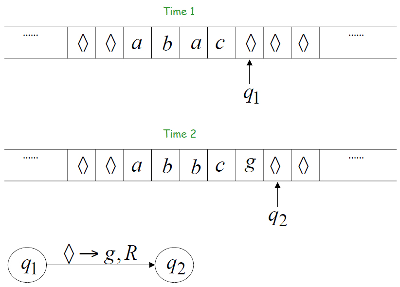
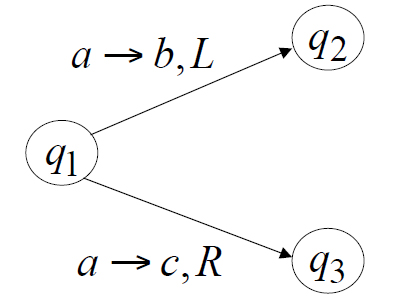

Turing Machines
===============
* A Turing machine helps define the concept of an algorithm
    * A universal Turing machine can be considered a model for a
computer in terms of capability
* Deterministic
* Halts if there are no possible transitions to follow
* **Turing's Thesis:** Any computation carried out by mechanical means can be performed by a Turing Machine
* Leads to a final state at which it then halts

The head at each time step:
1. Reads a symbol
2. Writes a symbol
3. Moves Left or Right

## Graph of possible transitions

## Example Movement

## Acceptance of Input
* **"Yes"**/Accept => If machine halts in a final state
* **"No"**/Reject => If machine halts in a non final state OR enters an infinite loop

## Non-Deterministic Turing Machines
* When there is more than one option that the machine could choose from (It cannot *determine* which to choose since both are valid, it must guess)

### Theorem
* Deterministic Machines have the same power as Non-Deterministic machines
* This is in terms of capability to compute a function or recognize a string
* Time taken by a deterministic Turing Machine may be exponential compared with a Non-Deterministic machine

*Note:* A Non-Deterministic machine can “solve” a problem by guessing a solution (in a non-deterministic phase) and then deterministically verify that solution
* Thus, if one can deterministically verify a solution, then a non-deterministic machine can “solve” that problem
